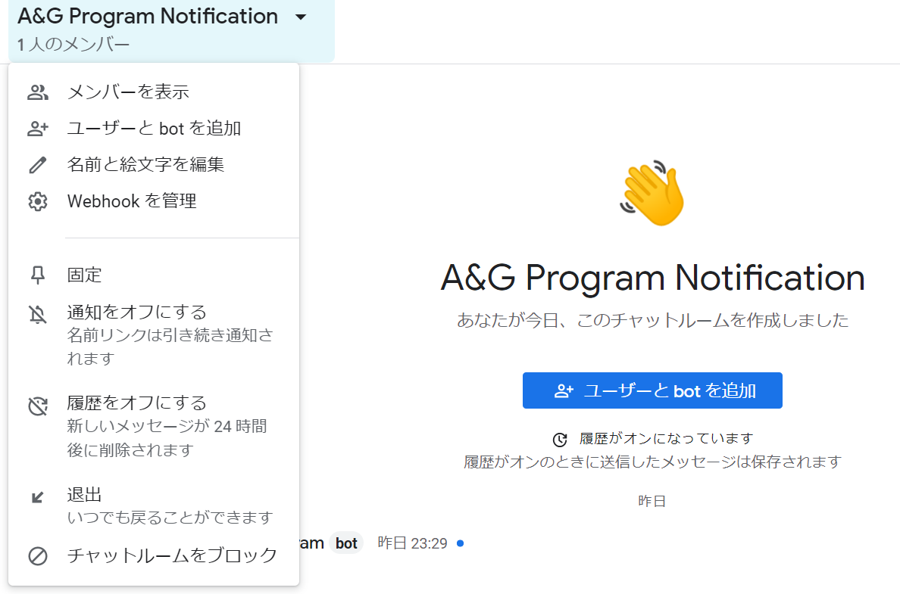
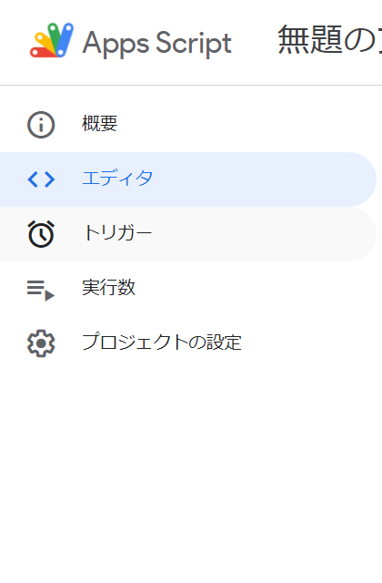

# About coriander
get registed your favorite voice actors radio program of Radio Broadcaster 超A&amp;G. 
it notifies through google chat bot.

## Setting

### 1. Make Google Spread Sheet

You have to make Google Spreaed Sheet.
next, write your favorite voice actor or animation title as a search Keyword on col:A.
for examle...


You can input 100 keywords.
if you input over 100, change source code around the line 58 of main.js.

before: getRange(1, 1, 100)
after: getRange(1, 1, **xxx**)

finally, copy spread Sheet URL.

push 「共有」 button.


and push 「リンクをコピー」button


and paste copied link on aroud line 47 of main.js.

```JavaScript
const SP_URL = 'copied link';
```

### 2. Make Google Chat Room

select 「Webhookを管理」



input name freely, and push save button.


copy Webhook's link


and paste copied link on aroud line 29 of main.js.

```JavaScript
const WEBHOOK_URL = 'copied link';
```

### 3. Regist Apps Script

access [Google Apps Script](https://script.google.com/).

select 「新しいプロジェクト」


copy all source code of main.js.
and paste コード.js.
Then, select 「トリガー」



and setting like this.


